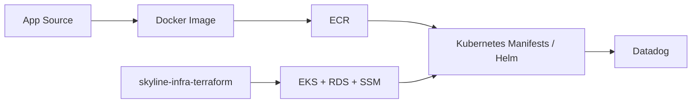

# skyline-app

[한국어 README](./README.md)

This repo is not primarily about the airline-reservation domain itself.  
It is a demo application repo that shows how a **Spring Boot + React application was shaped into an EKS-friendly workload and connected to an observability path**.

The main signal is not feature work. It is:

- Docker-based container builds
- runtime configuration for an external MySQL / RDS backend
- Kubernetes manifests and a Helm-chart example
- secret wiring through SSM Parameter Store + External Secrets
- readiness for Datadog APM and log collection

> This repo does not claim to be a production-ready service.  
> A more accurate description is a PoC workload snapshot intended to run on top of the EKS/RDS environment prepared by the infra repo.

## Overview



## What This Repo Demonstrates

- Running a Spring Boot application against an external MySQL / RDS backend
- Building a single container image that also serves the React static assets
- Making the Kubernetes deployment path explicit through `namespace`, `ExternalSecret`, `Deployment`, `Service`, and `Ingress`
- Preparing the hooks needed for Datadog APM and logs in an Operator-based setup
- Explaining the PoC boundary instead of overselling the repo as fully production-ready

## Summary

| Area | Contents |
|---|---|
| Backend | Spring Boot 3.2, Java 17, Spring Web, Spring Data JPA, Actuator |
| Frontend | React + Vite |
| Database | MySQL |
| Container | Multi-stage Docker build |
| Kubernetes | basic manifests, Helm chart example, HPA example |
| Observability | Prometheus metrics endpoint, Datadog Agent / admission integration points |

## Repo Structure

```text
frontend/                React UI
src/                     Spring Boot application
sql/                     schema and seed data
scripts/                 build / RDS init helpers
k8s-examples/basic/      namespace, secret, deployment, service, ingress
k8s-examples/advanced/   Helm chart, HPA example
k8s-examples/datadog/    DatadogAgent example
docs/                    API, deployment, troubleshooting notes
```

## Quick Start

### 1. Local Docker Run

The fastest path is Docker Compose.

```bash
docker compose up --build
```

Basic checks:

```bash
curl -i http://localhost:8080/health
curl -i http://localhost:8080/ready
curl -i http://localhost:8080/api/flights
```

### 2. Build an Image Manually

```bash
docker build -t skyline:latest .
```

Or use the helper script:

```bash
./scripts/build.sh
```

### 3. Initialize Demo Data for RDS

If you are using the Terraform-created RDS instance, apply the schema and seed data with:

```bash
./scripts/init-database.sh <rds-endpoint> <db-user> <db-password> skylineapp
```

## EKS Deployment Contract

The Kubernetes examples in this repo assume the infra repo has already created:

- an EKS cluster
- an RDS MySQL instance
- SSM Parameter Store values for the database
- External Secrets IAM permissions
- the AWS Load Balancer Controller

Primary manifests:

- `k8s-examples/basic/00-namespace.yaml`
- `k8s-examples/basic/secret-store.yaml`
- `k8s-examples/basic/secret.yaml`
- `k8s-examples/basic/deployment.yaml`
- `k8s-examples/basic/service.yaml`
- `k8s-examples/basic/10-ingress.yaml`

Recommended sequence:

```bash
kubectl config current-context
kubectl get crd externalsecrets.external-secrets.io secretstores.external-secrets.io
kubectl get deployment -n external-secrets
kubectl get deployment -n kube-system aws-load-balancer-controller

kubectl apply -f k8s-examples/basic/
kubectl rollout status deployment/skyline-app -n skyline
```

The app expects these Parameter Store keys:

- `/skyline-system-demo/demo/database/host`
- `/skyline-system-demo/demo/database/port`
- `/skyline-system-demo/demo/database/name`
- `/skyline-system-demo/demo/database/username`
- `/skyline-system-demo/demo/database/password`

## Runtime Contract

Main environment variables:

- `DB_HOST`
- `DB_PORT`
- `DB_NAME`
- `DB_USER`
- `DB_PASSWORD`
- `DB_CONNECTION_POOL_SIZE`

Primary endpoints:

- `GET /api/flights`
- `GET /api/flights/{id}`
- `GET /api/flights/search`
- `POST /api/reservations`
- `GET /health`
- `GET /ready`
- `GET /actuator/prometheus`

Operationally relevant behavior:

- the default datasource targets MySQL
- the default profile keeps schema mode at `validate`
- the `production` profile uses `ddl-auto=update` to simplify first-run demo setup
- health, info, metrics, and prometheus endpoints are exposed
- readiness includes DB health through Actuator probes

## Datadog

`k8s-examples/datadog/datadog-agent.yaml` is an example `DatadogAgent` custom resource that assumes an existing Datadog Operator installation.

Required prerequisites:

- Datadog Operator installed
- Datadog Operator CRDs installed
- a `datadog-secret` in the `datadog` namespace

Example flow:

```bash
helm repo add datadog https://helm.datadoghq.com
helm repo update
helm install datadog-operator datadog/datadog-operator -n datadog --create-namespace

kubectl create secret generic datadog-secret -n datadog \
  --from-literal api-key='YOUR_REAL_DATADOG_API_KEY'

kubectl apply -f k8s-examples/datadog/datadog-agent.yaml
kubectl rollout restart deployment/skyline-app -n skyline
```

The Datadog direction here is intentionally closer to a low-cost dev setup:

- `/health` and `/ready` traces sampled at 0%
- remaining traces sampled at 5%
- cluster checks and orchestrator explorer disabled

In other words, the goal is not full telemetry maturity. It is to connect logs and lightweight APM for the demo environment.

## Helm and Kubernetes Notes

- `k8s-examples/advanced/helm-chart` assumes an existing `skyline-db-secret`.
- `k8s-examples/advanced/hpa.yaml` is an autoscaling example, not a fully validated production manifest.
- Public access is intentionally designed through `Ingress` and ALB rather than a public `Service`.

## PoC Boundary

What this repo proves:

- a workable container and manifest path for deploying the demo app to EKS
- secret consumption through Parameter Store + External Secrets
- the basic application hooks needed for Datadog APM and log collection

What this repo does not prove:

- a production-grade release pipeline
- a formal migration framework
- a complete structured logging and alerting contract
- a hardened authn/authz or business-grade security model

The value of this repo is not the feature surface of the application. It is that the app was packaged as something a platform can operate more predictably.

## Related Repo

- Infra / EKS / RDS provisioning: `skyline-infra-terraform`
- Additional notes: [`docs/API.md`](./docs/API.md), [`docs/DEPLOYMENT.md`](./docs/DEPLOYMENT.md), [`docs/TROUBLESHOOTING.md`](./docs/TROUBLESHOOTING.md)
