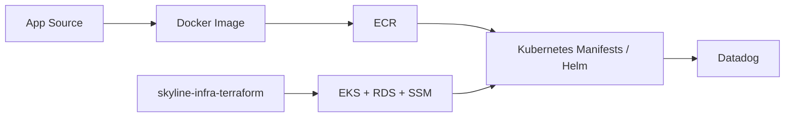

# skyline-app

[English README](./README.en.md)

이 repo는 항공 예약 도메인 자체를 강조하기 위한 프로젝트라기보다,  
**Spring Boot + React 애플리케이션을 EKS에서 운영 가능한 workload로 정리하고 observability 경로까지 연결한 결과**를 보여주기 위한 demo application repo입니다.

핵심은 기능 추가보다 아래 항목에 있습니다.

- Docker 기반 container build
- RDS 연동을 전제로 한 runtime configuration
- Kubernetes 배포 매니페스트와 Helm chart 예시
- SSM Parameter Store + External Secrets 기반 secret 연결
- Datadog 연동을 고려한 health / tracing / log collection 준비

> 이 repo는 production-ready 서비스 완성본을 주장하지 않습니다.  
> 보다 정확히는, 인프라 repo에서 준비한 EKS/RDS 환경 위에 애플리케이션 전달 경로를 올려보는 PoC workload snapshot입니다.

## Overview



## 이 repo가 보여주는 것

- Spring Boot 애플리케이션을 외부 MySQL(RDS) 기준으로 실행 가능한 형태로 구성
- React 정적 리소스를 함께 포함한 단일 컨테이너 이미지 빌드
- Kubernetes에서 `namespace`, `ExternalSecret`, `Deployment`, `Service`, `Ingress`를 분리해 배포 경로를 설명 가능하게 구성
- Datadog Operator 환경에서 APM / logs 연결을 위한 주입 지점을 준비
- demo 범위와 production 경계를 README에서 분리해 설명

## 구성 요약

| 영역 | 내용 |
|---|---|
| Backend | Spring Boot 3.2, Java 17, Spring Web, Spring Data JPA, Actuator |
| Frontend | React + Vite |
| Database | MySQL |
| Container | Multi-stage Docker build |
| Kubernetes | basic manifests, Helm chart example, HPA example |
| Observability | Prometheus metrics endpoint, Datadog Agent / admission 연계 준비 |

## Repo Structure

```text
frontend/                React UI
src/                     Spring Boot application
sql/                     schema and seed data
scripts/                 build / RDS init helpers
k8s-examples/basic/      namespace, secret, deployment, service, ingress
k8s-examples/advanced/   Helm chart, HPA example
k8s-examples/datadog/    DatadogAgent example
docs/                    API, deployment, troubleshooting notes
```

## Quick Start

### 1. Local Docker Run

가장 빠른 확인 경로는 Docker Compose입니다.

```bash
docker compose up --build
```

기본 확인:

```bash
curl -i http://localhost:8080/health
curl -i http://localhost:8080/ready
curl -i http://localhost:8080/api/flights
```

### 2. Build an Image Manually

```bash
docker build -t skyline:latest .
```

또는 보조 스크립트:

```bash
./scripts/build.sh
```

### 3. Initialize Demo Data for RDS

Terraform으로 생성한 RDS를 사용하는 경우, 필요 시 아래 스크립트로 schema와 seed data를 반영할 수 있습니다.

```bash
./scripts/init-database.sh <rds-endpoint> <db-user> <db-password> skylineapp
```

## EKS Deployment Contract

이 repo의 Kubernetes 예시는 인프라 repo에서 아래 선행 조건이 준비된 상태를 전제로 합니다.

- EKS cluster
- RDS MySQL instance
- SSM Parameter Store database values
- External Secrets IAM permissions
- AWS Load Balancer Controller

기본 매니페스트:

- `k8s-examples/basic/00-namespace.yaml`
- `k8s-examples/basic/secret-store.yaml`
- `k8s-examples/basic/secret.yaml`
- `k8s-examples/basic/deployment.yaml`
- `k8s-examples/basic/service.yaml`
- `k8s-examples/basic/10-ingress.yaml`

권장 순서:

```bash
kubectl config current-context
kubectl get crd externalsecrets.external-secrets.io secretstores.external-secrets.io
kubectl get deployment -n external-secrets
kubectl get deployment -n kube-system aws-load-balancer-controller

kubectl apply -f k8s-examples/basic/
kubectl rollout status deployment/skyline-app -n skyline
```

앱은 아래 Parameter Store 키를 기대합니다.

- `/skyline-system-demo/demo/database/host`
- `/skyline-system-demo/demo/database/port`
- `/skyline-system-demo/demo/database/name`
- `/skyline-system-demo/demo/database/username`
- `/skyline-system-demo/demo/database/password`

## Runtime Contract

주요 환경변수:

- `DB_HOST`
- `DB_PORT`
- `DB_NAME`
- `DB_USER`
- `DB_PASSWORD`
- `DB_CONNECTION_POOL_SIZE`

기본 endpoint:

- `GET /api/flights`
- `GET /api/flights/{id}`
- `GET /api/flights/search`
- `POST /api/reservations`
- `GET /health`
- `GET /ready`
- `GET /actuator/prometheus`

운영 관점에서 의미 있는 설정:

- 기본 datasource는 MySQL 기준으로 구성
- 기본 profile에서는 schema를 `validate`
- `production` profile에서는 초기 demo 구동 편의를 위해 `ddl-auto=update`
- health, info, metrics, prometheus endpoint 노출
- readiness에 DB health가 포함되도록 Actuator probe 사용

## Datadog

`k8s-examples/datadog/datadog-agent.yaml`은 Datadog Operator가 이미 설치된 클러스터를 전제로 하는 `DatadogAgent` custom resource 예시입니다.

필수 선행 조건:

- Datadog Operator 설치
- Datadog Operator CRDs 설치
- `datadog` namespace의 `datadog-secret`

예시 순서:

```bash
helm repo add datadog https://helm.datadoghq.com
helm repo update
helm install datadog-operator datadog/datadog-operator -n datadog --create-namespace

kubectl create secret generic datadog-secret -n datadog \
  --from-literal api-key='YOUR_REAL_DATADOG_API_KEY'

kubectl apply -f k8s-examples/datadog/datadog-agent.yaml
kubectl rollout restart deployment/skyline-app -n skyline
```

이 repo의 Datadog 방향은 low-cost dev setup에 가깝습니다.

- `/health`, `/ready` trace sampling 0%
- 나머지 trace sampling 5%
- cluster checks, orchestrator explorer 비활성화

즉, 모든 telemetry를 완전 수집하기보다, demo 환경에서 logs와 lightweight APM을 우선 연결하는 데 초점을 맞췄습니다.

## Helm and Kubernetes Notes

- `k8s-examples/advanced/helm-chart`는 기존 `skyline-db-secret`이 이미 존재한다고 가정합니다.
- `k8s-examples/advanced/hpa.yaml`은 autoscaling 예시이며, 운영 검증이 충분히 끝난 production manifest를 의미하지는 않습니다.
- public access는 `Service`가 아니라 `Ingress`와 ALB 경로를 기준으로 설계했습니다.

## PoC Boundary

이 repo가 증명하는 것:

- demo application을 EKS에 올릴 수 있는 container and manifest path
- Parameter Store + External Secrets 기반 secret consumption 흐름
- Datadog APM / log collection 연결을 위한 기본 준비

이 repo가 증명하지 않는 것:

- production-grade release pipeline
- 정교한 migration framework
- 완전한 structured logging / alerting contract
- 고도화된 authn/authz 또는 business-grade security model

즉, 이 repo의 가치는 애플리케이션 기능 자체보다 **플랫폼에서 운영 가능한 전달 단위로 정리했다는 점**에 있습니다.

## Related Repo

- Infra / EKS / RDS provisioning: `skyline-infra-terraform`
- Additional notes: [`docs/API.md`](./docs/API.md), [`docs/DEPLOYMENT.md`](./docs/DEPLOYMENT.md), [`docs/TROUBLESHOOTING.md`](./docs/TROUBLESHOOTING.md)
